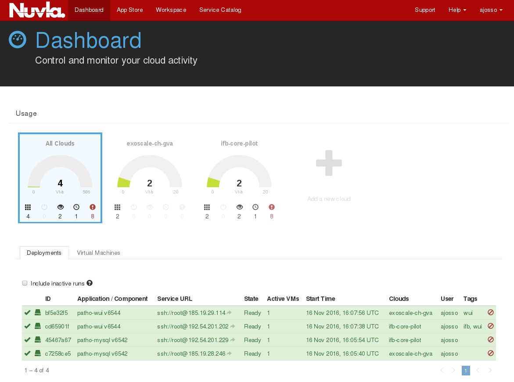
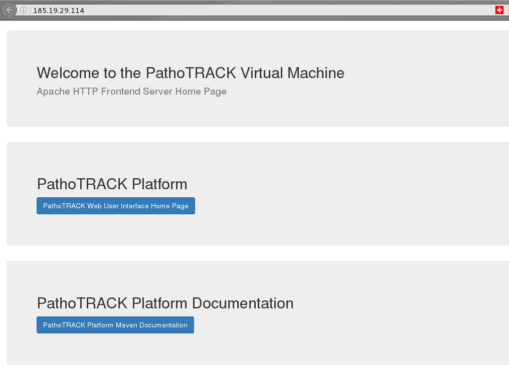
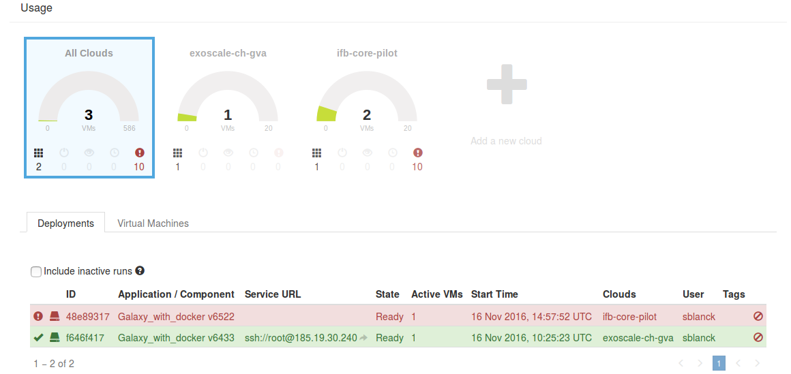
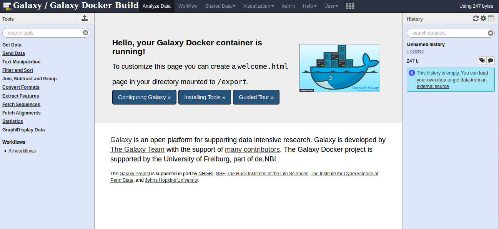

*Put your demo there*

# UC2 Cloud virtual pipeline for microbial genomes analysis

## Insyght

## SGE and miniconda

## Scripts
Function (that will be) used in UC2 are regrouped in [./scripts/](https://github.com/cyclone-project/usecases-hackathon-2016/tree/master/scripts) with a HOWTO detailing their usage. [A component](https://nuv.la/module/cyclone/neo4j/script_tester#5-application-workflows+4-deployment) and [a recipe](https://nuv.la/module/cyclone/neo4j/allows_access_example/6553#1-application-components) have been made to allow you to see them in action.

# UC3 Live remote cloud processing of sequencing data

# UC11 Assembling genomes from sequencing reads 

# UC12 MetaGenomics - PathoTRACK app

Hackathon Goals: 

- Create a VM with the PathoTRACK platform using Slipstream and launch it on Exoscale Cloud and IFB Openstask cloud (pilot)
- Test edugain authentication in Galaxy

Application and components are available in [UC12 folder in Slipstream workspace](https://nuv.la/module/cyclone/UC12_metagenomics_pathotrack).

2 components are working at the end of the hackathon: mysql server and PathoTRACK web user interface server.

Next steps will be the configuration of input and output variables for components and try to interconnect them in application configuration.

# UC13 Shared environment between cloud Galaxy portals 

Hackathon Goals: 

- create a VM with the a dockerized version of Galaxy using Slipstream and launch it on Exoscale Cloud and IFB Openstask cloud (pilot)
- Test edugain authentication in Galaxy

Application and components are available in [UC13 folder in Slipstream workspace](https://nuv.la/module/cyclone/UC13-Galaxy).

At the end of the Hackathon, a dockerized version of galaxy (version 6433) has been deployed on exoscale, but some problem during docker installation remain on the IFB core pilot.

Next steps will be able to deploy the VM on the IFB core pilot and to be able to authenticate user with edugain credentials.

