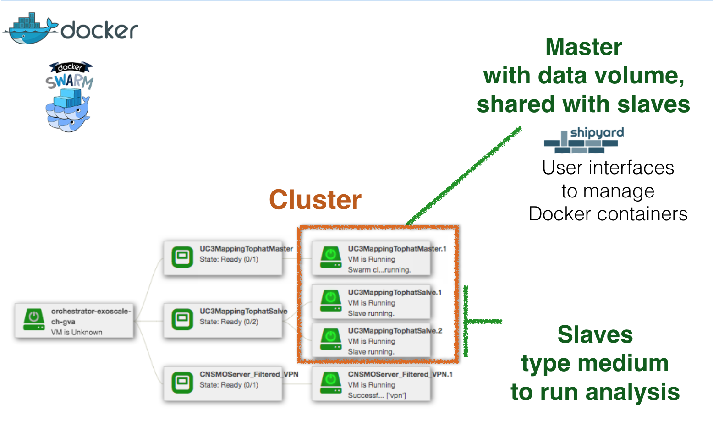

*Put your demo there*

# UC2 Cloud virtual pipeline for microbial genomes analysis

## Insyght
Hackathon Goals for UC2 bacterial genomics:
- organize the VM infrastructure and who do what with Bryan and Jonathan. The problem with the current implementation is that it relies on an image of bacterial genomics for the master and the slave. The bacterial genomics image is quite big and deploying multiples nodes causes frequent crashes. We agreed on a multi-layer implementation in slipstream that will be minimal for the slaves (blast and klast only as 3rd party software).
	- Bryan and Jonathan are in charge of the "core" VM layers: SGE cluster in a VPN, miniconda, etc… (See below).
	- I take care of the install specific to the bacterial genomics master VM (Bacterial_Genomics_v3_master): insyght app and pipeline, 3rd party bioinformatics softwares, postgresql, …
- create a Bacterial_Genomics_v3_master VM using Slipstream and launch it on the IFB Openstask cloud (pilot): I started with the install of bioperl through the perl installer (not conda) and launched it successfully on the IFB Openstask cloud (pilot). The bioperl install can be replaced by the conda install once I extend the SGE_Miniconda_Master VM by Jonathan. For me the next steps will be to continue installing the Bacterial_Genomics_v3_master via slipstream and contact Bryan and Jonathan when it is done.
The Application and components are available in the [Bacterial_Genomics folder in Slipstream workspace](https://nuvla.cyclone-project.eu/module/cyclone/Bacterial_Genomics/6409)

## SGE and miniconda

Hackathon Goals:
- Create SGE cluster in a VPN (without VPN in progress)
- Install blast on slave with Miniconda

The recipe is available [here](https://nuv.la/module/cyclone/Bacterial_Genomics/SGE_Miniconda_cluster).

Features:
- Deployment SGE cluster with or without VPN
- Scalable for add or remove VM, see [here](https://github.com/cyclone-project/usecases-hackathon-2016/blob/master/scalable-howto.md)
- Miniconda ready on Master and Slaves with "Application Parameters", see [master](https://nuv.la/module/cyclone/Bacterial_Genomics/SGE_Miniconda_Master#4-application-parameters) or [slave](https://nuv.la/module/cyclone/Bacterial_Genomics/SGE_Miniconda_Node#4-application-parameters)

## Scripts
Function (that will be) used in UC2 are regrouped in [./scripts/](https://github.com/cyclone-project/usecases-hackathon-2016/tree/master/scripts) with a HOWTO detailing their usage. [A component](https://nuv.la/module/cyclone/neo4j/script_tester#5-application-workflows+4-deployment) and [a recipe](https://nuv.la/module/cyclone/neo4j/allows_access_example/6553#1-application-components) have been made to allow you to see them in action.

# UC3 Live remote cloud processing of sequencing data
## Design on UC-3:
- create cluster with :
	- one master who share disk on data and reference genome with all slaves;
	- x slaves who analysis data, one sample per slave ;
- integrate an graphique interface to launch docker and monitore cluster, with Shipyard ;

## Technologies used :
- Docker swarm has been choice for cluster. Involve a docker images exit for each tool used to analysis. In demo, the exemple use Tophat2 for mapping step and for post-processing output files with samtools. Docker version used is 1.11.3;
- VPN, use CNSMO solution, CNSMO agent is the base on all nodes ;
- authentification with edugain.

## During hackathon:
- add a web page to see and dowload output files. The access use edugain authentification;
- improve vizualization of results;

# UC11 Assembling genomes from sequencing reads 

# UC12 MetaGenomics - PathoTRACK app

Hackathon Goals: 

- Create a VM with the PathoTRACK platform using Slipstream and launch it on Exoscale Cloud and IFB Openstask cloud (pilot)
- Test edugain authentication in Galaxy

Application and components are available in [UC12 folder in Slipstream workspace](https://nuv.la/module/cyclone/UC12_metagenomics_pathotrack).

2 components are working at the end of the hackathon: mysql server and PathoTRACK web user interface server.

Next steps will be the configuration of input and output variables for components and try to interconnect them in application configuration.

# UC13 Shared environment between cloud Galaxy portals 

Hackathon Goals: 

- create a VM with the a dockerized version of Galaxy using Slipstream and launch it on Exoscale Cloud and IFB Openstask cloud (pilot)
- Test edugain authentication in Galaxy

Application and components are available in [UC13 folder in Slipstream workspace](https://nuv.la/module/cyclone/UC13-Galaxy).

At the end of the Hackathon, a dockerized version of galaxy (version 6433) has been deployed on exoscale, but some problem during docker installation remain on the IFB core pilot.

Next steps will be able to deploy the VM on the IFB core pilot and to be able to authenticate user with edugain credentials.

